## SWD600 - AE2 Pattern Library
### Sam Johns
#### 17th May 2019

[simplePattern documentation](https://2johns25.github.io/SWD600_AE2/index.html)  
[GitHub Repository](https://github.com/2johns25/SWD600_AE2)
___

# Introduction

### Background

Maintaining a consistent website can be difficult for large organisations, where multiple web designers and developers will come along and add their own pieces of code over a long period of time. To help combat this problem, a pattern library can be adopted which helps to maintain consistency across a website [Boag, 2017](https://boagworld.com/design/pattern-library/).

### Aim

The aim of this project is to create a simple pattern library which will include, what's considered the very essential UI components of any pattern library, plus extra, and produce a small website to document those UI components, which can be downloaded and used by other web designers and developers.

# Research

### Pattern libraries

According to Lazier (2015), not every project necessarily needs to start from nothing, and sometimes requires a tried and tested solution, to ensure that a website is consistent and robust. This is the purpose of a pattern library. Pattern libraries are a collection of UI elements in the form of HTML snippets, which can be used across multiple projects, over and over again. (Rutherford, 2017). According to Rutherford, the term pattern library is often used interchangeably, but they are actually different things entirely. A design system is a combination of a pattern library and style guide as well as rules and standards, to ensure that they are used properly.

There are a plethora of pattern libraries available for designers and developers to use; notable ones are [Simple Grid]( http://simplegrid.io/), [Skeleton]( http://getskeleton.com/) and the most popular and widely used, [Bootstrap]( https://getbootstrap.com/). These offer pre-built UI components such as grids, buttons, jumbotrons, typographic elements and so on. While these are useful when it comes to maintaining consistency and having a break-proof solution, [Davies (2018)]( https://medium.com/@whatjackhasmade/pattern-libraries-abcc45c6144c) notes some common issues with this approach, which are websites looking too much alike and not being unique, the system might not provide you with everything that you need and the need to adopt another developers naming conventions and standards. 

Instead, large companies opt to create their own pattern libraries as part of a larger design system. Good examples of these are [Atlassian]( https://atlassian.design/guidelines/product/overview), [MailChimp]( http://ux.mailchimp.com/patterns/color) and [Gov.uk]( https://design-system.service.gov.uk/get-started/). These websites contain large quantities of pages and components, which will only grow larger and in order to facilitate that in a structured way, they use their pattern libraries. 

[<i>UK Government website pattern library</i>](https://design-system.service.gov.uk/get-started/)

For companies that allow other designers and developers to build user interfaces for products associated with their business, they have an even more reason to create and enforce a pattern library, as it helps to maintain their brand. Good examples of this are [Apple]( https://developer.apple.com/design/human-interface-guidelines/) and [Google Android]( https://material.io/design/foundation-overview/#addition).

[<i>Apple pattern library</i>](https://developer.apple.com/design/human-interface-guidelines/)

### Development options

There are a few options when it comes to developing and implementing a pattern library, for example, pre-built frameworks that enable you to build your own pattern library. Notable examples are [Patternlab]( https://patternlab.io/), which provide you with the ability to create design systems using the [atomic design principle]( http://bradfrost.com/blog/post/atomic-web-design/), developed by Brad Frost, in which a larger system is comprised of smaller components.

[<i>Atomic design process</i>](http://bradfrost.com/blog/post/atomic-web-design/)

Another pre-built tool is [Fabricator]( https://fbrctr.github.io/), which [Davies (2018)]( https://medium.com/@whatjackhasmade/pattern-libraries-abcc45c6144c) claims is the “quickest and most efficient” framework for creating a pattern library. A framework specifically for Vue, is [Vue Styleguidist]( https://vue-styleguidist.github.io/), enabling you to develop isolated Vue components as an interactive style guide.

[<i>Vue Styleguidist webpage </i>](https://vue-styleguidist.github.io/)

Other than taking an already existing pattern library and adapting the source code to your needs, another popular option and the one that is being opted for in this project, is to create a pattern library with documentation and UI components, from scratch using basic HTML, CSS and JavaScript. This option was chosen because doesn’t require any prior knowledge of other systems and therefore won't require the learning new syntax or standards and provides freedom to create whatever, with no boundaries.

# Design process method

Due to time constraints and other assignment deadlines, a traditional design process per se wasn’t followed. This project was very much a case of researching what other pattern libraries were available, what they included, how they included it, and then designing a solution that was reminiscent of those but with an original design and implementation. Therefore the design process was as followed:

* Research  
* Design  
* Development   
* Testing  

# Testing

### Functional testing

To ensure that users of the pattern library can actually access the library and implement the elements within their own projects, functional testing will take place during and at the end of development. 

This will take the form of accessing the final website in different browsers, at different viewport sizes. The website will be tested in the browsers: Mozilla Firefox, Safari and Google Chrome, on a MacBook Pro, as well as Safari and Google Chrome on an iPhone XS Max.

### User testing

User testing will take the form of informal, local, moderated user testing, with 5 participants being asked to interact with the pattern library and the documentation, and have them state how much they agree with statements given to them about the site. The answers will be used to provide each element of the final project an average score of 5.0. This will indicate what pieces of the pattern library people didn't like.

# Specification

### UI elements

The following UI components must be included within the pattern library:

* Navigation bar  
* Header  
* Jumbotron  
* Grid
* Range of six buttons
* Feedback blocks
* Footer
* Components must be responsive
* Components must be designed consistently

### Documentation 

The following requirements for the documentation must be implemented:

* The documentation must contain a home page, with instructions to use the pattern library
* The documentation must contain a download button, for users to download the pattern library
* The documentation must be responsive
* Code snippets must be styled appropriately 
* Each component must have its own page
* Each page must contain a header
* Each page must contain an introduction paragraph
* Each page must contain examples of each component  
* Each page must contain HTML code snippets of each component

# Design and planning

In terms of design and planning, the only wireframe produced was for the basic design of the website. Each page was designed exactly the same but with different titles.

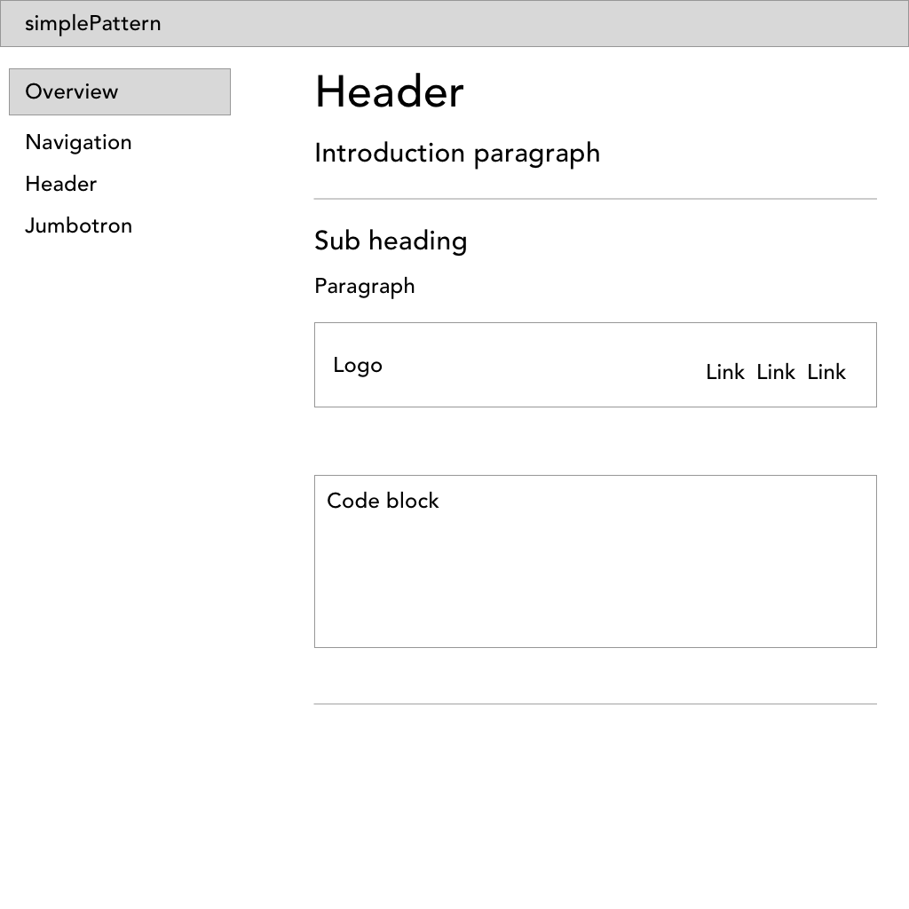
<i>Wireframe</i>

# Implementation

### Documentation

The site for the simplePatterns documentation was produced using basic HTML and CSS. The overall structure of the site was achieved through the use of CSS flexbox, which enabled the implementation of a simple fluid, responsive design, making it available for view on smaller screen sizes.

### UI elements

Below are the final versions of the UI components created for the simplePattern library. The structure for each element was created using HTML and then styled with plain CSS. Once the structure and styling was completed, the interactive elements were implemented using the JavaScript library: JQuery.

#### Navigation

[<i>simplePattern navigation</i>](https://2johns25.github.io/SWD600_AE2/navigation.html)

The navigation was implemented as a horizontal bar, which takes up the full width of the viewport. The design for the navigation was created using flexbox, which enabled the logo to be positioned to the very left of the container and the navigation links to be positioned to the very right of the container. When the size of the viewport is decreased, the navigation gets smaller with the navigation links moving to left and being positioned next to the logo.

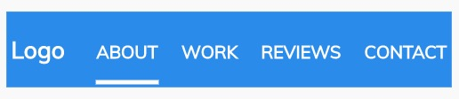
[<i>simplePattern navigation</i>](https://2johns25.github.io/SWD600_AE2/navigation.html)

#### Header

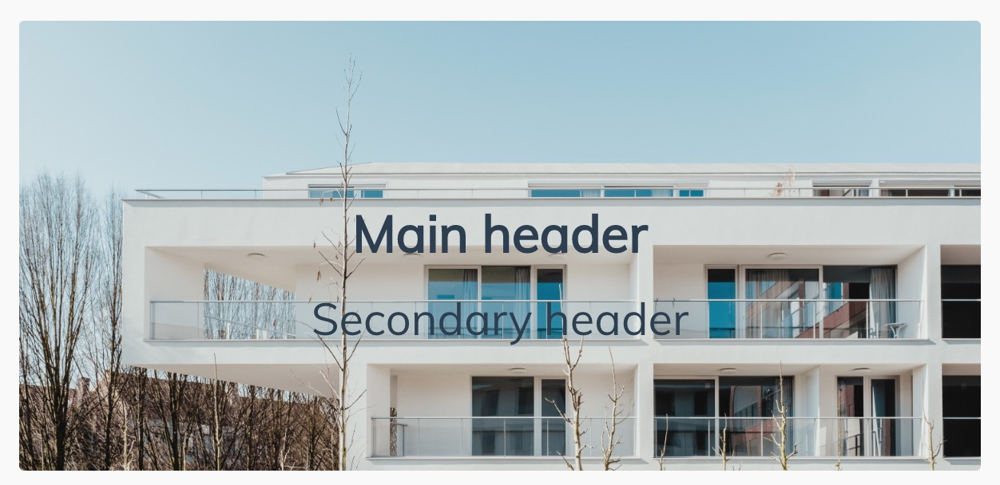
[<i>simplePattern header</i>](https://2johns25.github.io/SWD600_AE2/header.html)

Three versions of the header were produced to provide developers with a choice as to how they implement a header. The default header features a picture as the background, with dark text as the default, with no overlay over the image. This is for instances where a developer doesn't uses text colour and background that has good levels of contrast already.

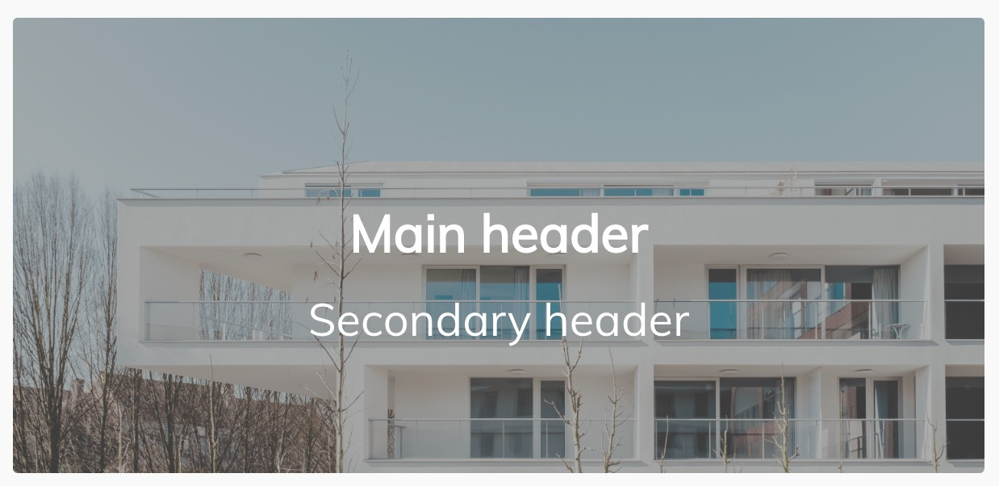
[<i>simplePattern header</i>](https://2johns25.github.io/SWD600_AE2/header.html)

The header version with the dark overlay was created to provide the oppurtunity for developers to use an image and light text, but what might not have good contrast. By putting a dark, low-opacity layer on top of the image, the light text is easily readable. Similarly, with the dark version of the header, the light version is to enable developers to use dark text on the top of a lighter overlay. 

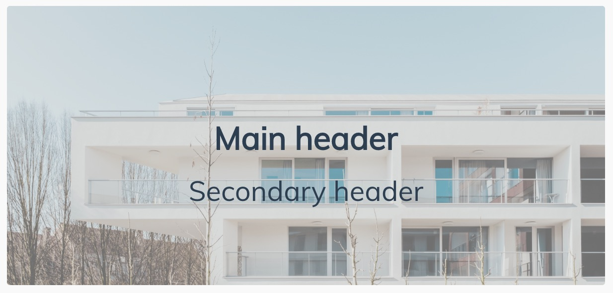
[<i>simplePattern header</i>](https://2johns25.github.io/SWD600_AE2/header.html)

All three versions of the headers take up the full width of the screen and are responsive. The overlay can be added using the `.dark` or `.light` classes on the `.header_overlay` element. The light text is selected by using the `.light_text` class on the `.header_text_container` element.

#### Jumbotron

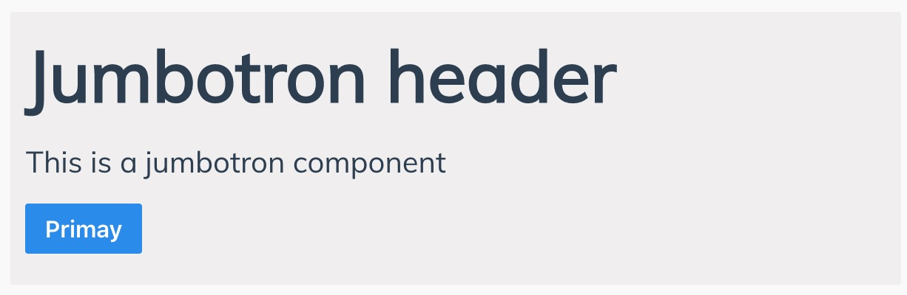
[<i>simplePattern jumbotron</i>](https://2johns25.github.io/SWD600_AE2/jumbotron.html)

The jumbotron is a very basic element, making use of the CTA button. This too is responsive and takes up the full width of its container. This is invoked by using the `.jumbotron class` on a div. Further text and headers can be added to the jumbotron, and the CTA button can be changed to a small input form.

#### Grid

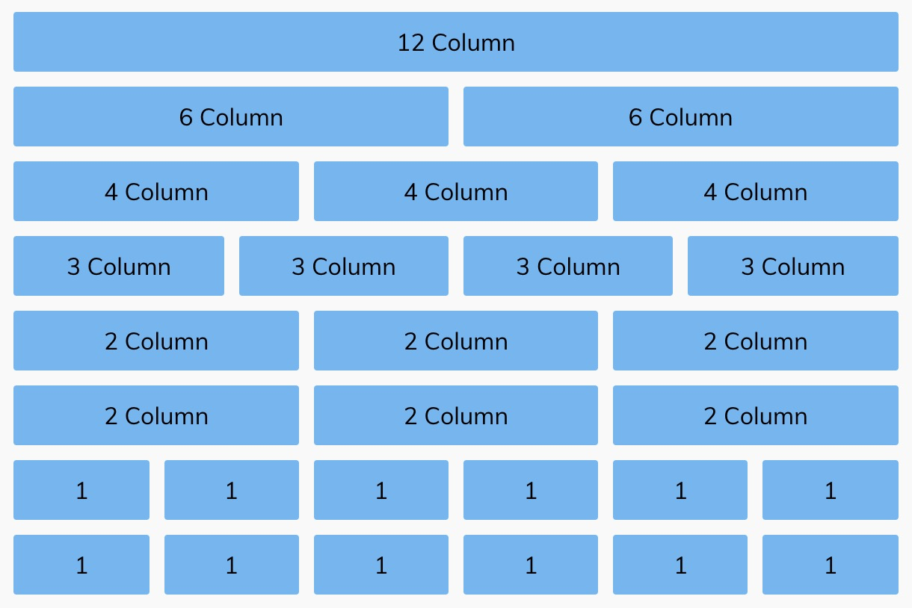
[<i>simplePattern grid</i>](https://2johns25.github.io/SWD600_AE2/grid.html)

simplePatterns grid is a responsive 12 column grid made from basic CSS floats, which takes up 100% of the viewport, but has a `max-width: 1600px;`. The total grid is contained within the `.grid` container, which is followed by a `.row`, which contains columns using the `.col-sm-#`, `.col-md-#`, and `.col-wd-#` classes to determine how many columns an element should take up based on what the current width of the viewport is.

The grid, as well as all the other responsive components, use the following media queries to adjust to the change in viewport sizes:

`Mobile first - smaller devices (portrait phones, 320px and up)`

`@media only screen and (min-width: 600px) {}`

`@media only screen and (min-width: 768px) {}`

`@media only screen and (min-width: 992px) {}`

#### Buttons

A total of 6 button types were produced for the simplePattern library. To maintain continuity, each button was given a `padding: 7px 12px;`. The 6 types of buttons that were created were:

* Filled
* Outlined
* Text
* Dropdown
* Grouped
* Disabled

##### Generic buttons

The three basic types of buttons are the filled, outlined and text. These also come in different colours to indicate what they do. Grey is the default colour, blue is for CTA buttons, yellow is for warning buttons which might have a significant impact on the user's system and red is a critical button, which when pressed will cause irreversible changes to the system.

In order to implement a button, the `.btn` class is added to a div. To use either a filled, outlined or text button, the `.filled`, `.outline` or `text` button is used and to choose a colour, the `.primary`, `.warning` `.critical` classes are added.

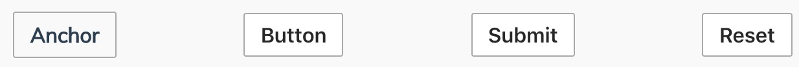  
[<i>simplePattern buttons</i>](https://2johns25.github.io/SWD600_AE2/buttons.html)

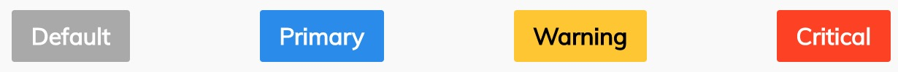  
[<i>simplePattern buttons</i>](https://2johns25.github.io/SWD600_AE2/buttons.html)

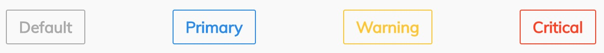  
[<i>simplePattern buttons</i>](https://2johns25.github.io/SWD600_AE2/buttons.html)

  
[<i>simplePattern buttons</i>](https://2johns25.github.io/SWD600_AE2/buttons.html)

##### Dropdown

Drop-down buttons are used to present a list of options and actions that the user can interact with. These use JQuery to present the user with the dropdown menu when the button is clicked, and hide the dropdown menu when the user clicks either the button or another element. The buttons that activate the drop-down feature are basic buttons using `.btn` classes and the classes used to style filled, outlined and text buttons.

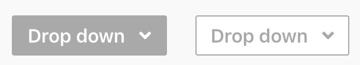  
[<i>simplePattern buttons</i>](https://2johns25.github.io/SWD600_AE2/buttons.html)

##### Button group

This button category is a group of buttons that allow users to select choices from a list, perhaps as part of a form or secondary navigation. These were able to be implemented without JavaScript using radio buttons, rather than generic buttons or similar elements, which would require JavaScript. However, this does mean that more HTML and CSS is required to implement this feature.

  
[<i>simplePattern buttons</i>](https://2johns25.github.io/SWD600_AE2/buttons.html)

##### Disabled

The disabled button is similar to the other generic buttons in that they use the `.btn` class, but it also uses the `.disabled` class, styling it grey, giving the user the impression that it is an "empty" element and can't be interacted with. This sort of button can be used in forms if a user hasn't entered any information in any of the form fields yet.

#### Feedback blocks

Feedback blocks are used to provide information to the user when they have completed a particular action. simplePattern's feedback blocks are basic HTML and CSS elements which can be enhanced with JavaScript, to appear once the user has completed an action. The colours used are different from the generic buttons, in that they are lighter so they're not so striking the eye. Furthermore, green needed to be used to confirm that action was successfully completed, as opposed to blue.

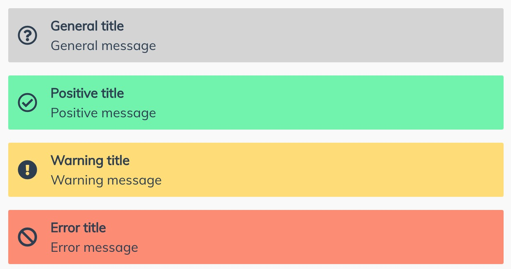  
[<i>simplePattern Feedback blocks</i>](https://2johns25.github.io/SWD600_AE2/feedback.html)

#### Footer

simeplePattern's footer  is comprised of three flexbox columns: one for site links, one for social media links and another for the logo. Below them, is the traditional copyright notice often found at the footer of websites. Flexbox was chosen because it easily creates a responsive element when the viewport size is changed.

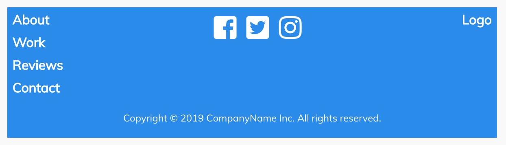  
[<i>simplePattern Feedback blocks</i>](https://2johns25.github.io/SWD600_AE2/footer.html)

  
[<i>simplePattern Feedback blocks</i>](https://2johns25.github.io/SWD600_AE2/footer.html)

# Conclusion

Out of the 5 of people that were asked to help with the user testing, 3 were able to and accepted. They were instructed to interact with the documentation site and pattern library and then given a series of statements, to which they had to state to what extent they agreed with the statements. Based on their answer, each aspect of the project was given an average score out of 5.0.

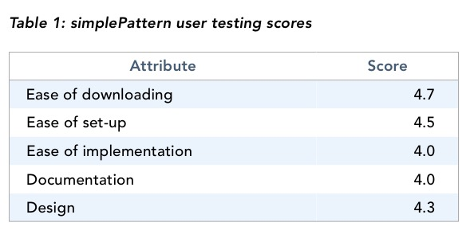
<i>User testing results</i>

The results from the user testing show that overall users were able to easily download and set-up the pattern library to use in their project. However, it appears that they were unable to easily implement it within their project. Furthermore, it seems that the documentation wasn't as helpful as it could've been. Perhaps there wasn't enough guidance on each element. Furthermore, the design for pattern library wasn't highly rated, suggesting that there could be significant design improvements to the library. Despite that, when users had the pattern library working, the elements worked as they should. 

