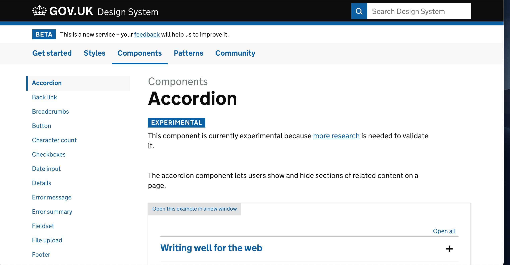
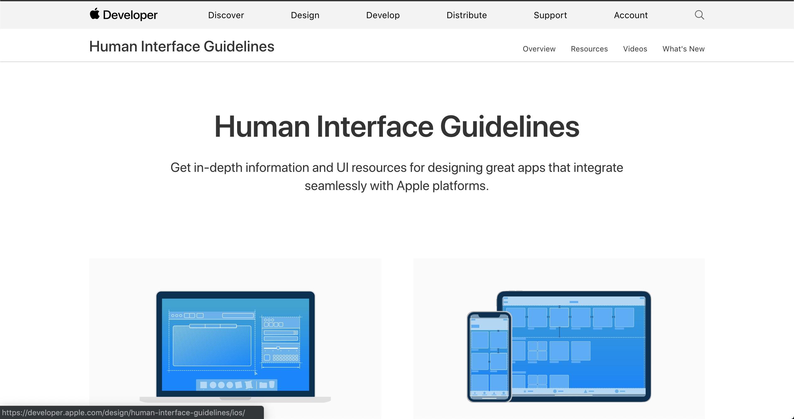
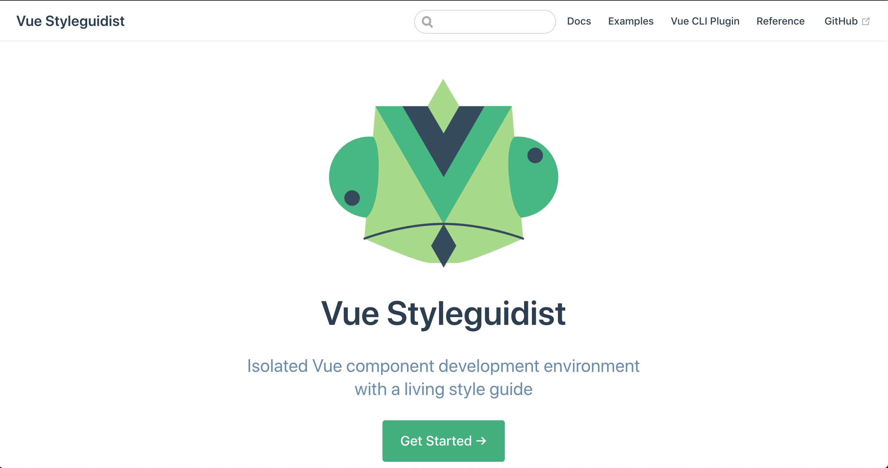

## SWD600 - AE2 Pattern Library
### Sam Johns
#### 17th May 2019

[simplePattern documentation](https://2johns25.github.io/SWD600_AE2/index.html)  
[GitHub Repository](https://github.com/2johns25/SWD600_AE2)
___

# Introduction

### Background

Maintaining a consistent website can be difficult for large organisations, where multiple web designers and developers will come along and add their own pieces of code over a long period of time. To help combat this problem, a pattern library can be adopted which helps to maintain consistency across a website [Boag, 2017](https://boagworld.com/design/pattern-library/).

### Aim

The aim of this project is to create a simple pattern library which will include, what's considered the very essential UI components of any pattern library, plus extra, and produce a small website to to document those UI components, which can be downloaded and used by other web designers and developers.

# Research

### Pattern libraries

According to Lazier (2015), not every project necessarily needs to start from nothing, and sometimes requires a tried and tested solution, to ensure that a website is consistent and robust. This is the purpose of a pattern library.
Pattern libraries are a collection of UI elements in the form of HTML snippets, which can be used across multiple projects, over and over again. (Rutherford, 2017). According to Rutherford, the term pattern library is often used interchangeable, but they are actually different things entirely. A design system is a combination of a pattern library and style guide as well as rules and standards, to ensure that they are used properly. 
There are a plethora of pattern libraries available for designers and developers to use; notable ones are [Simple Grid]( http://simplegrid.io/), [Skeleton]( http://getskeleton.com/) and the most popular and widely used, [Bootstrap]( https://getbootstrap.com/). These offer pre-built UI components such as grids, buttons, jumbotrons, typographic elements and so on. While these are useful when it comes to maintaining consistency and having a break-proof solution, [Davies (2018)]( https://medium.com/@whatjackhasmade/pattern-libraries-abcc45c6144c) notes some common issues with this approach, which are websites looking too much alike and not being unique, the system might not provide you with everything that you need and the need to adopt another developers naming conventions and standards. 

Instead, large companies opt to create their own pattern libraries as part of a larger design system. Good examples of these are [Atlassian]( https://atlassian.design/guidelines/product/overview), [MailChimp]( http://ux.mailchimp.com/patterns/color) and [Gov.uk]( https://design-system.service.gov.uk/get-started/). These websites contain large quantities of pages and components, which will only grow larger and in order to facilitate that in a structured way, they use their pattern libraries. 

[<i>UK Government website pattern library</i>](https://design-system.service.gov.uk/get-started/)

For companies that allow other designers and developers to build user interfaces for products associated with their business, they have an even more reason to create and enforce a pattern library, as it helps to maintain their brand. Good examples of this are [Apple]( https://developer.apple.com/design/human-interface-guidelines/) and [Google Android]( https://material.io/design/foundation-overview/#addition).

[<i>Apple pattern library</i>](https://developer.apple.com/design/human-interface-guidelines/)

### Development options

There are a few options when it comes to developing and implementing a pattern library, for example pre-built frameworks that enable you to build your own pattern library. Notable examples are [Patternlab]( https://patternlab.io/), which provide you with the ability to create design systems using the [atomic design principle]( http://bradfrost.com/blog/post/atomic-web-design/), developed by Brad Frost, in which a larger system is comprised of smaller components.

[<i>Atomic design process</i>](http://bradfrost.com/blog/post/atomic-web-design/)

Another pre-built tool is [Fabricator]( https://fbrctr.github.io/), which [Davies (2018)]( https://medium.com/@whatjackhasmade/pattern-libraries-abcc45c6144c) claims is the “quickest and most efficient” framework for creating a pattern library. A framework specifically for Vue, is [Vue Styleguidist]( https://vue-styleguidist.github.io/), enabling you to develop a isolated Vue components as an interactive styleguide.

[<i>Vue Styleguidist webpage </i>](https://vue-styleguidist.github.io/)

Other than taking an already existing pattern library and adapting the source code to your needs, another popular option and the one that is being opted for in this project, is to create a pattern library with documentation and UI components, from scratch using basic HTML, CSS and JavaScript. This option was chosen because doesn’t require any prior knowledge of other systems and therefore wont require the learning new syntax or standards, and provides freedom to create whatever, with no boundaries.

# Design process method

# Testing

### Technical testing

#### Documentation

#### UI elements

### User testing

#### Documentation

#### UI elements

# Specification

### UI elements

### Documentation 

# Design and planning

### Documentation

### UI elements

# Experimentation

# Implementation

### Documentation

### UI elements

#### Navigation

#### Header

#### Jumbotron

#### Grid

#### Buttons

#### Feedback blocks

#### Footer

# Conclusion

